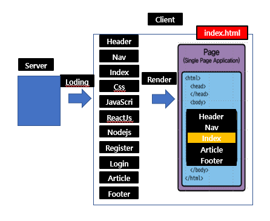
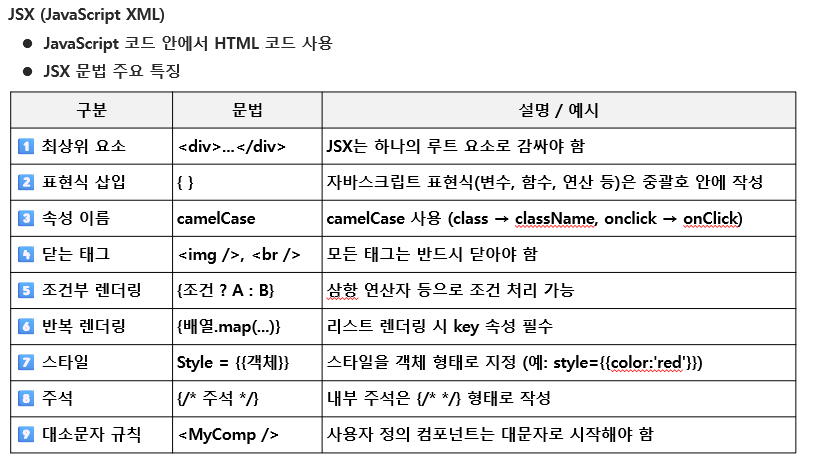

# 고급웹프로그래밍
 - 10~11 문제
 코드 작성 위주 X
 이론 + 코드 이해 방식 문제

### React 특징
 - 자바 스크립트 기반 유저 인터페이스

 1) Component 기반  
  -> 독립적인 기능을 가진 화면 조각  
 2) SPA 기반  
  ->   
 3) 가상 돔(VIrtual DOM) 기반  
  ->   
 4) JSX 문법 기반  
  ->   
 5) Data 중심   
   ->   

### Component
 - 전체 화면을 작은 조각으로 나눈 모듈

<장점>
 1) 재사용성
 2) 빠른 업데이트와 렌더링 속도
 3) 유지 보수 용이

### SPA(Single Page Application)
 - 전체 화면이 하나의 HTML 페이지로 구성 (컴포넌트 조립)  
 

### 가상 DOM(Virtual DOM)
 - 실제 DOM을 복사한 랜더링 안되는 DOM

### Data 중심
 -   

### React 웹 특징
 - 서버 최초 방문 시,  
  -> 모든 리소스를 받아 온다(사용하지 않는 리소스도 받아와 초기 로딩 속도가 오래걸림)  
 - 서버 방문 이후 업데이트  
 -> 클라이언트 측에서 변경된 부분만 랜더링 

### JSX (중요, 예제도 잘 봐야함)

리액트는 카멜케이스(ClassName)

#### InLine 조건
 - 조건 