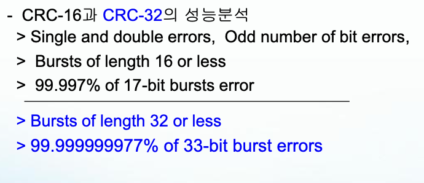
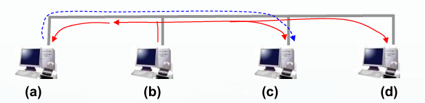
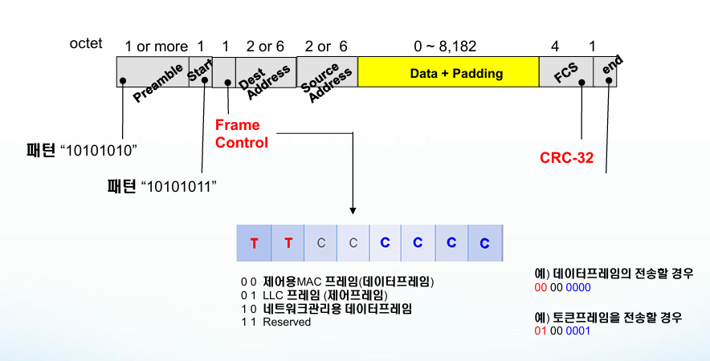
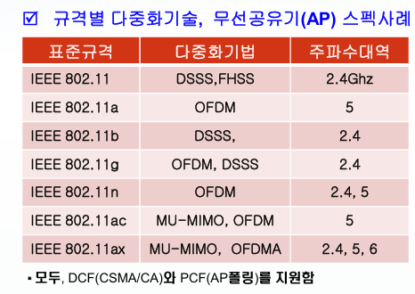
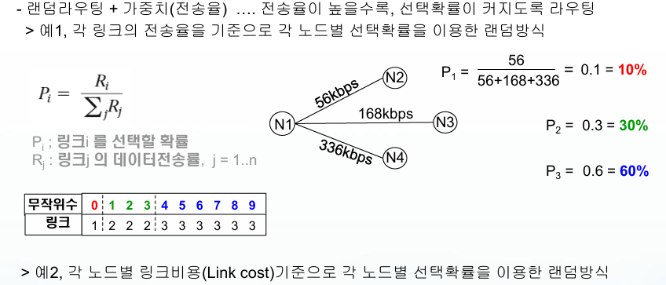

# 1차 쪽지시험

## Chapter. 2 물리계층

### 데이터 통신

#### 데이터 통신
 : 컴퓨터를 전선(전송매체)으로 연결하고, 이 매체로 데이터를 송신/수신하는 기술  
 : 통신할 컴퓨터가 점점 많아지면, 송수신 통신기술이 크게 복잡해지는 문제가 발생한다.

#### 프로토콜(Protocol)
 : 다양한 네트워크에서 정확한 통신을 이루려면 통신용 약속이 필요한데,   
 데이터를 송/수신간에 정확히 주고 받기 위해, 정해진 전송규약

#### 프로토콜의 특징
```
 1) 계층화
 2) 유지보수/변경이 용이
 3) 표준화
```

#### 프로토콜의 3대요소
 1) **Syntax(형식)** : 송수신기간의 주고받아야 할 **전송데이터의 포맷** 정의
 2) **semantic(의미)** : 송수신기간의 상호협력을 위한 **제어정보**를 정의
 3) **Timing(타이밍)** : 송수신기간의 전송데이터를 주고 받을 때 **속도와 전송절차**를 정의

#### 프로토콜 설계
1) **주소설정** : 네트워크 상에서 송/수신 호스트를 구분하기 위한 식별자
2) **오류제어** : 신호감쇄/왜곡으로 인한 오류발생 > 탐지 > 복구
3) **흐름제어** : 수신호스트의 버퍼처리속도가 늦어서 송신호스트의 속도를 제어
4) **연결제어** : 데이터를 전송하기 전에 상호 송수신이 가능한 상태로 설정/해제/관리하는 제어
5) **순서제어** : 전송데이터에 순서를 매겨서 메세지의 분실여부, 재전송에 사용
6) **전송데이터의 단편화/재조합** : 전송효율을 높이고자 작은 크기의 전송메세지를 줄여 전송 후 수신할 때 응용 프로그램에서 원래의 크기로 재조합하는 과정
7) **캡슐화** : 데이터를 제어 정보를 덧붙임
8) **동기화** : 여러 시스템이 동시에 통신할 수 있는 기법

<div style="page-break-before: always;"></div>

#### 전송모드
| 전송모드              | 방향성           | 특징        | 예시        |
| ----------------- | ------------- | --------- | --------- |
| Simplex (단방향)     | 한쪽 방향         | 수신만 가능    | 키보드 → CPU |
| Half Duplex (반이중) | 양쪽 방향 (동시 불가) | 충돌 가능성 존재 | 무전기       |
| Full Duplex (전이중) | 양쪽 방향 (동시 가능) | 가장 효율적    | 전화기       |


#### 프로토콜 참조모델(7계층)


| 구분 | 설명 | 특징 / 장단점 | 활용 예시 |
|------|------|---------------|-----------|
| **물리 계층** | 데이터 전송 규격 정의 | 전송매체의 기계적, 전기적 특성 정의 | LAN 케이블 등 |
| **Twisted Pair** | 꼬인 구리선 케이블 | 외부 간섭 감소, 전송 거리 짧음, 설치 용이, 저렴한 비용 | 전화선, LAN |
| **STP** | 금속 차폐막 포함 | 간섭에 강함, 고비용, 데이터 보안성 향상 | 금융기관, 병원 |
| **UTP** | 금속 차폐막 없음 | 저비용, 노이즈 간섭에 약함 | 가정용 네트워크 |
| **Coaxial Cable (동축 케이블)** | 중심 도체 + 차폐층 | 장거리, 외부 잡음에 강함 | TV, CCTV |
| **Fiber Optic Cable (광섬유 케이블)** | 광섬유로 빛 전송 | 저나기 간섭이 전혀 없음, 초고속 대역폭, 장거리, 고가 | 백본망, 통신망 |


<div style="page-break-before: always;"></div>

#### 무선 전송매체의 전파 유형
 1) 지면전파 : 대기권의 낮은 부분으로 전자기파를 전파하는 방식  
 2) 공중전파 : 안테나를 전파하거나, 전리층에서 반사하는 방식으로 전파  
 3) 가시선전파 : 안테나간 높은 주파수로 전파

#### 무선 전송매체
 1) RadioWave : 고체, 진공, 대기를 모두 통과하여 전파 ( 3KHz ~ 300MHz )
 2) MicroWave : 지향성, 단방향 전파, 가시선 전파, 벽을 통과 못함 ( 300MHz ~ 300GHz )
 3) Infrared(적외선) : 단거리 전파에 적합하며, 열에너지를 포함하고 있어 물체를 따듯하게 만듬 ( 300GHz ~ 400THz )

### 신호처리

#### 데이터 전송 
 : 이진데이터를 전기적 신호로 변환하고, 전파시킴 ( 송신할 데이터 > 신호 > 수신할 데이터 )
```
[신호 변환]
 - 아날로그 신호 <-> 아날로그 데이터
 - 아날로그 신호 <-> 디지털 신호
 - 디지털 신호 <-> 아날로그 데이터
 - 디지털 신호 <-> 디지털 데이터

[전송]
 - 아날로그 전송
 - 디지털 전송
```

#### 신호
 1) 진폭 : 신호의 높이  
 2) 주기 : 반복되는 패턴(단위 초) | 주기 = 1 / 주파수Hz  
 3) 주파수 : 1초당 주기의 반복횟수(단위 Hz)   


<div style="page-break-before: always;"></div>

 #### 디지털 변환 기법

 
 #### 아날로그 변환 기법
 

<div style="page-break-before: always;"></div>

 #### PCM(Pulse Code Modulation) 기법
 : 아날로그신호 -> 디지털 데이터
  > 변환과정 : 1) 샘플링 -> 2) 양자화 -> 3) 인코딩  

  **양자화 레벨이 높을수록 정밀도와 전송량이 증가한다**

  

  #### 전송장애(전송오류)
  1) 신호감쇄
  2) 왜곡
  3) 잡음
  4) 간섭

  #### 물리계층의 대표장비
  1) 증폭기
   : 감쇄된 신호크기를 증폭시켜 원래의 신호크기로 키워주는 장치 / 증폭기로 신호를 증폭한다

  2) 리피터
  : 수신한 신호를 다시 인코딩하여 송신하는 장치 / 리피터로 신호를 재생한다(케이블 연장 선)

<div style="page-break-before: always;"></div>

  ## Chapter 3. 데이터링크 계층
  
  #### 데이터 링크 계층
   : **노드와 노드 간의 오류가 없는 데이터전송**울 하기 위한 목표로 전송 규격을 정의 

  #### 데이터 링크 계층의 핵심기능
  1) 주소 관리 : 물리 주소 체계를 정의
  2) 접근제어/링크제어 : 물류계층의 특성과 구조에 맞게 접근
  3) 프레임생성/관리 : 데이터를 캡슐화한 프레임형식으로의 생성 및 관리
  4) 오류 제어 : 오류를 탐지하고 복구
  5) 흐름 제어 : 수신기가 송신기의 전송속도를 제어

#### 오류의 원인
1) 물리계층의 전송 장애로 오류 발생
2) 송신노드 또는 수신노드의 장애
3) 전송매체의 절단, 파괴 등의 장애
4) 저속 전송매체로 데이터를 빠른속도로 무리하게 송신하는 경우


#### 프레임
: 데이터 링크 계층에서 전송되는 전송 데이터 단위를 뜻함

#### 오류 검출
1) Parity비트 검출법  
 : 데이터에서 1의 개수를 홀수(또는 짝수)로 맞추어 전송하며, 수신계에서 개수를 확인하는 기법  
 : 문제점으로는 2비트 이상이 오류 나면 검출 성능이 떨어진다  
  (Even : 짝수, Odd : 홀수)  

2) 2차원 Parity비트 검출법
 : 데이터를 (블록단위) 분할 후, 행과 열에 각각 비트를 추가하여 오류를 검출
 

3) CheckSum (1Byte) 검출법
 : 데이터를 1 Byte단위로 XOR를 하여 CheckSum을 생성한 후 전송
 

4) Internet CheckSum 검출법 (2Byte)


16진수 1의 보수는 15-N (1~9 A~F)

### 오류 복구/정정

#### 역방향 오류 정정
1) **Stop-And-Wait ARQ**  
 : 프레임 1개를 전송할 때마다 , ACK를 기다림

2) **Go-Back-N ARQ**  
 : 프레임을 계속 보내다가, NAK가 온 이후의 모든 프레임을 재전송함

3) **Selective-reject ARQ**   
 : 프레임을 계속 보내다가, NAK가 온 프레임만 재전송
 

<div style="page-break-before: always;"></div>

#### 전방향 오류 정정
 : 수신된 프레임만을 가지고 오류정정을 할 수 있는 방식  
 

 모든 패리티가 0이면 오류가 없는 것이고, 그렇지 않으면 오류가 발생한 것이다.  
 결과가 0101이면 오류가 있는 숫자이고, 이를 10진수로 변환하면 5 ( 0 + 4 + 0 + 1 )   

 #### 흐름 제어
 - **흐름 제어 원인** : 송신노드와 수신노드의 처리성능이 다르기에 필요한 제어 기능  
 - **흐름 제어 방법** : 수신노드가 송신노드의 송신 시점을 제어함


 1) Stop & Wait 흐름 제어 기법
  : 전송 프레임당 응답을 수신하는 흐름제어 기법  
  

 2) Sliding Windows 흐름제어 기법
  : 응답없이 보낼 수 있는 프레임의 최대 개수를 채택함(범위 : 0 ~ 2ⁿ - 1)  
  

 3) PiggyBacking 기법
  : 응답용 ACK 프레임을 별도로 전송하지 않고, 데이터 프레임에 응답을 같이 포함시켜 보내는 기법
 


| 기법             | 특징              | 장점     | 단점       |
| -------------- | --------------- | ------ | -------- |
| Stop & Wait    | 매 프레임마다 ACK 대기  | 구현 단순  | 효율 낮음    |
| Sliding Window | 여러 프레임 송신 가능    | 효율 높음  | 복잡도 증가   |
| Piggybacking   | 데이터 + ACK 동시 전송 | 트래픽 감소 | 지연 발생 가능 |

<div style="page-break-before: always;"></div>

### 문자프레임


#### 접근제어/링크제어관리
  | 구성 방식 | 연결 형태 | 특징 | 장점 | 단점 |
|-----------|-----------|------|------|------|
| Point-to-Point | 1:1 | 노드 간 경쟁 없음, 단순 송수신 | 충돌 없음, 안정적 | 확장성 낮음, 매체 많이 필요 |
| Multi-Drop | 1:N | 여러 노드 공유, 충돌 가능 | 매체 절약, 여러 노드 연결 가능 | 충돌 가능, 접근 제어 필요


<div style="page-break-before: always;"></div>

## Chapter 4. 데이터링크 계층 2
 | 모드 | 동작 방식 | 특징 | 장점 |
|------|-----------|------|------|
| 정규 응답모드 (NRM) | 주국이 세션 시작, 종국은 응답만 | 전송 시작과 제어는 주국 담당 | 구현 단순, 제어 명확 |
| 비동기 균형모드 (ABM) | 양쪽 모두 명령과 응답 가능 | 전이중 전송에서 효과적 | 양방향 자유, 전송 효율 높음 |
| 비동기 응답모드 (ARM) | 주국이 전송 시작, 종국은 주국 승인 없이 데이터 송신 가능 | 주/종 관계 유지, 데이터 전송은 자유 | 데이터 전송 유연, 주국 과부하 감소 |


### HDLC 프레임

1) Flag
 - 특정 비트패턴으로 프레임을 구분하며, 송신 스테이션이 추가
 - 수신 스테이션이 지속적으로 Flag를 검출하며 플레임 동기화를 실현

2) Address
 - 가변크기
 - Point-to-Point는 주소가 필요없어, 의미없는 데이터 1로 패딩하여 데이터를 송신함
 - Multi-Point는 주소 마지막 Byte의 맨앞 '1'로 설정한다

3) Control
 - 정보 프레임 : 데이터를 전송할 때 사용하는 프레임
 - 감독 프레임 : 링크설정, 링크해제 등 제어용 프레임
 - 비번호 프레임 : 흐름제어와 오류제어용으로 사용하는 프레임  


<div style="page-break-before: always;"></div>

4) FCS
 - 오류 검출을 위한 필드 (2 혹은 4 Bytes )
 - 기본 다항식 16 bit CRC-CCITT 다항식 또는 32 비트 CRC-32
 

| 구성요소    | 역할        | 특징               |
| ------- | --------- | ---------------- |
| Flag    | 프레임 경계 식별 | 01111110 고정      |
| Address | 목적지 식별    | P2P에서는 의미 없음     |
| Control | 프레임 종류 지정 | 정보, 감독, 비번호 프레임  |
| FCS     | 오류 검출     | CRC-16 or CRC-32 |


 ### 네트워크 토폴로지
 

 ### LAN 프로토콜 계층
 - IEEE 표준 LAN에서 사용하는 데이터링크 프로토콜
 - LAN에서는 데이터 링크 계층이 MAC 계층과 LLC 계층으로 분리되어 있음

 ### LLC 계층
 - HDLC 프로토콜과 유사한 기능을 제공
 - 링크를 생성/관리 흐름제어 등 전송에 집중된 기능을 제공


### MAC 계층
 - 접근제어, 오류 검출 집중된 기능을 제공

 #### Ethernet ( IEEE 802.3 )
  - Bus형(더미허브), Star형(스위치)
  - Bus형에서의 데이터 전송  
     
    -> (b)에서 (d)로 데이터를 송신할 경우 전송신호는 전송매체 전체로 전파됨
    -> 만약 (a)가 (c)에게 동시에 데이터를 송신할 경우, 전송매체에서는 신호의 충돌이 발생함

  #### FirmWare 형태
   - MAC 주소(물리적 주소) 48 bit로 구성되어 있음  
   

  #### CSMA/CD ( IEEE 802.3 )
   1) 데이터를 송신할 때 전송 충돌을 혀옹하되, 충돌이 발생하면 이를 피하여 재전송으로 해결  
   2) 전송매체의 길이가 길수록, 전송 지연이 증가하여 충돌 가능성이 높아짐
   3) 대표적인 경쟁 기반 프로토콜 (Contention Based Protocol)
   4) 재전송 시, 재충돌 가능성을 줄이기 위해, 시간대를 달리하는 방식으로 진행
    -> 랜덤시간만큼 대기한 후(BackOff) 재전송

  - BackOff 전략 :  2⁰ x 512bit 전송시간  
   -> * ⁰는 충돌 횟수 (예 : 10번째 충돌일 때 2^10 이므로 0~1023 중 랜덤 선택 )

  #### 토큰 링(IEEE 802.5)
  1) 물리적으로 링 형태로 네트워크를 구성
  2) 매체 접근 제어 기준
  ```
  1) 토큰을 보유한 노드만이 전송권을 갖음
  2) 네트워크가 활성화되면, 특정노드가 토큰을 생성 후 한방향으로만 전송함 (Round Robin 방식)
  3) 토큰이 되돌아 오면 다시 새 토큰을 생성하여 전송
  4) 경쟁을 하지 않고, 토큰 프레임으로 충돌을 회피하는 방식
  ```

  #### 토큰버스 ( IEEE 802.4 )
  1) 물리적 구성은 Bus 형태이나, 논리적 구성은 토큰을 사용하는 Ring 형태임
  2) Bus구조에서는 충돌이 발생되기 때문에 토큰 으로 순서를 결정함
  3) 매체 접근 제어 기준
  ```
  1) 토큰을 가진 노드만이 전송할 수 있음
  2) 최초 노드가 토큰을 생성한 후, 한방향으로만 정송하고 되돌아오면 다시 토큰을 생성하여 전송 (Round Robin 방식)
  ```

<div style="page-break-before: always;"></div>

  #### 프레임 생성/관리
  1) IEEE 802.3 (유선랜)  
  

  2) IEEE 802.4 (토큰 버스)
  

  3) IEEE 802.5 (토큰 링)
  

<div style="page-break-before: always;"></div>

  #### 브릿지
  - 수신한 신호를 다시 인코딩하여 송신하는 장치 (리퍼터 기능 내장)

  #### 스위치 - Star 형
  1) MAC주소를 기반으로 프레임을 목적지 포트로 전달하여 충돌이 발생하지 않도록 해주는 네트워크 장비
  2) 포트별로 충돌 도메인 분리 가능, MAC 주소 학습 및 필터링, 포워딩 기능 수행, 전이중 방식

  | 구분              | Dummy HUB (Shared Hub)                   | Switch HUB (L2 Switch)                 |
|-------------------|-------------------------------------------|-----------------------------------------|
| 구조              | Star 구조(물리적), Bus 구조(논리적)       | Star 구조                              |
| 전송 속도         | 고정 (예: 10Mbps)                         | 증가 (동시 전송 가능)                  |
| 충돌 가능성       | 높음 (CSMA/CD 활용)                       | 낮음                                   |
| 동작 방식         | 모든 포트에 동일 신호 전송                | MAC Table + 스위칭 회로 이용           |
| 특징              | 충돌 발생 빈번, 현재는 사용되지 않음      | 충돌 거의 없음, 효율적인 통신 가능    |

<div style="page-break-before: always;"></div>

## Chapter 5. 무선 통신

### PHY 계층 (WLAN, IEEE 802.11)

 #### FHSS (주파수도약 스펙트럼 확산법)
  1) 신호를 전송할 때, 여러 주파수 채널 사이에서 빠르게 전환하는 방식
  2) 송신기와 수신기가 미리 정해진 난수로 주파수 채널을 변경
  3) 주파수간 간섭을 피할 수 있고, 도약 패턴이 랜덤하여 도청이 어려움(보안성이 높아짐)
  4) 대역폭 효율성이 낮다.

 #### DSSS (직교 시퀀스 스펙트럼 확산법)
  1) 원래의 신호에 주파수를 높인 확산코드를 곱하여, 대역폭을 확산시켜 전송하는 기법
  2) 송신기와 수신기가 미리 정해진 난수를 생성하여 변조
  3) 확산 효과로 신호대 잡음비의 개선, 보안성이 높음, 그러나 복잡하며 대역폭을 요구함

 #### OFDM (직교 주파수 분할 다중화 전송기법)
  1) FDM : 한 주파수 대역을 여러 채널로 나눈 뒤, 동시에 많은 신호를 전송하는 다중화 기법
  2) OFDM : 채널을 겁쳐, 작은 대역폭으로 많은 신호를 전송하는 기법
  3) 다중경로 페이딩에 강함, 주파수 효율성이 높지만, 주파수 동기화가 맞아야 하므로 복잡함.

 #### 무선 데이터 링크 계층
  1) 여러 개의 무선 노드들이 동일한 주파수 대역을 공유하기 때문에 서로 충돌하지 않고 전송하여야 하므로, 매체 접근 방식이 매우 중요함
  2) IEEE 802.11 의 LLC는 무선 특성에 맞도록 기존의 IEEE 802.2 LLC를 약간 변형해서 사용함

<div style="page-break-before: always;"></div>

  ### MCF 매체 접근 방식 (경쟁방식)
  | 구분 | 의미 | 대기 시간(예시) | 우선순위 | 사용 예 |
|------|------|---------|------------|--------------------|
| SIFS | Short IFS | 10 µs (2.4GHz), 16 µs (5GHz) | 1위  | ACK, CTS, Data→ACK 응답 |
| PIFS | PCF IFS | 19~30 µs (2.4GHz), 25 µs (5GHz) | 2위 | AP 폴링(Polling) |
| DIFS | Distributed IFS | 28~50 µs | 3위 | 일반 데이터 전송 시작 시 |

 ### DCF 매체 접근 방식 (경쟁방식)
  1) 긴 데이터 프레임을 전송할때는 충돌회피를 확실히 하여야 하므로 추가 보완 방법이 필요
  2) RTS와 CTS로 사전예약(미리공지)를 수행한 뒤에, 긴 데이터 프레임을 전송하는 충돌회피 방법
  3) RTS(Ready To Send), CTS(Clear To Send)  
  ```
  [동작 예]
   1) A가 RTS를 전송한다
   2) 전송범위에 B가 있다면 RTS 프레임을 받게 되고, 받으면 CTS 프레임을 전송
   3) A가 CTS를 받으며, B가 정상적으로 수신할 수 있다고 판단된다면 A가 B에게 데이터를 전송
  ```

### PCF 매체 접근 방식 (비경쟁방식)
 1) Coordinator(AP)가 각 무선 노드들의 전송순서를 직접 통제하여 충돌이 일어나지 않도록 전송매체의 접근을 제어하는 기법
 2) 폴링방식으로 각 노드들간의 데이터를 송수신함
 3) 충돌발생 가능성이 낮으며, 지연 시간의 예측과 감소 QoS 트래픽에 적합함
 4) 효율성이 낮으며 AP의 관리가 복잡하다.

### Piconet & Scatternet
 - Piconet : 네트워크 규모가 작다라는 의미
 - Scatternet : 1개의 스테이션이 브릿지가 되어, 2개의 피코넷을 연결

<div style="page-break-before: always;"></div>

### BlueTooth
 - 짧은 거리에서 무선으로 데이터를 전송할 수 있도록 해주는 기술


<div style="page-break-before: always;"></div>

## Chapter 6. 무선 통신

### 회선 교환망
 - 스위칭 기술을 이용하여 두 스테이션 사이에 통신경로(물리적링크, 논리적링크)를 위한 회선 교환 통신

```
[전송 과정 3단계]
 1) 회선 연결설정(전용회선)
   - 신호(데이터)가 전송되기 전에 스테이션과 스테이션 간에 회선이 설정 되어야 함
   - 이어지는 회선을 설정할 때 "회선정보, 가용성, 비용"을 고려해야 함

 2) 데이터전송(설정된 연결로)
   - 모든 데이터는 설정되어 있는 경로로만 전송되며, 아날로그 전송과 디지털 전송 모두 가능함

 3) 회선 해제
   - 보통 두 스테이션 중 하나가 연결이 해제시키며, 할당된 회선의 노드들에게 전파시켜 모두 해제함
```

### 회선스위칭 기술

#### 1. SDS (Space Division Switching) — 공간 분할 교환
- **개념**: 물리적으로 여러 개의 경로(회선)를 만들어 사용자마다 **고정된 전용 회선**을 제공하는 방식
- **방식**: 교환기의 **스위칭 매트릭스**를 통해 회선을 물리적으로 연결
- **특징**:
  - 구조가 단순함
  - 회선 점유율이 낮을 경우 비효율적
  - 확장성에 한계 존재
- **예시**: 전통적인 전화 교환기, Crossbar 스위칭

| 항목 | 내용 |
|------|------|
| 스위칭 대상 | 물리 회선(공간) |
| 연결 방식 | 물리적 경로 고정 |
| 장점 | 단순 구조, 지연 시간 거의 없음 |
| 단점 | 비효율적 자원 사용, 확장성 낮음 |

<div style="page-break-before: always;"></div>

#### 2. TDS (Time Division Switching) — 시분할 교환
- **개념**: 하나의 회선을 시간으로 나누어 **여러 사용자**가 번갈아 사용하는 방식
- **방식**: TDM(Time Division Multiplexing)을 사용해 시간 슬롯을 할당
- **특징**:
  - 공간이 아닌 **시간 자원**을 분할
  - 한 회선으로 여러 사용자 통신 가능
  - 시간 슬롯은 **고정 할당**
- **예시**: A=1번 슬롯, B=2번 슬롯, C=3번 슬롯 → 순차적으로 전송

| 항목 | 내용 |
|------|------|
| 스위칭 대상 | 시간 슬롯 |
| 연결 방식 | 고정된 시간 슬롯 할당 |
| 장점 | 회선 절감, 다중 사용자 가능 |
| 단점 | 슬롯이 고정되어 유연성이 떨어짐 |

<br><br>

#### 3. TSI (Time Slot Interchange) — 타임 슬롯 상호 교환
- **개념**: TDM으로 수집한 데이터를 **메모리에 저장한 뒤**, **다른 시간 슬롯 순서로 꺼내서 전송**하는 방식
- **방식**: Data Store + Address Store + Time Slot Counter
- **특징**:
  - 입력 시간 슬롯을 출력 슬롯으로 자유롭게 교환
  - 물리적인 회선을 바꾸지 않아도 경로 변경 가능
  - 스위칭 규칙에 따라 출력 순서 변경 가능
- **예시**: 입력 (1:A, 2:B, 3:C, 4:D), 스위칭 규칙 (1→3, 2→4, 3→1, 4→2) → 출력 (1:C, 2:D, 3:A, 4:B)

| 항목 | 내용 |
|------|------|
| 스위칭 대상 | 시간 슬롯 순서 |
| 연결 방식 | 저장 후 순서 변경 |
| 장점 | 유연한 스위칭 가능, 자원 절약 |
| 단점 | 메모리 및 제어 로직 필요 |

<div style="page-break-before: always;"></div>

#### 4. TMS (Time Multiplexed Switching) — 시분할 다중화 교환
- **개념**: SDS(공간 교환) + TSI(시간 교환)를 결합한 **복합 교환 방식**
- **방식**: 시간 슬롯 상호교환(TSI) 후 **공간 교환(SDS)**을 통해 대규모 네트워크 연결
- **특징**:
  - 대규모 교환망에서 효율적
  - 시간과 공간 자원을 모두 활용
  - TSI 단독 방식보다 처리량과 확장성 ↑
- **예시**: 중앙 TSI 장치에서 슬롯 재배치 후, SDS 매트릭스를 통해 다중 단말 연결

| 항목 | 내용 |
|------|------|
| 스위칭 대상 | 시간 + 공간 |
| 연결 방식 | 시간 교환 + 공간 교환 복합 |
| 장점 | 대규모 네트워크 적합, 효율성 높음 |
| 단점 | 구조 복잡, 비용 증가 |

<br>

| 구분 | SDS | TDS | TSI | TMS |
|------|-----|-----|-----|-----|
| 스위칭 방식 | 공간 | 시간 | 시간(순서 변경) | 시간 + 공간 |
| 자원 | 회선 | 시간 슬롯 | 시간 슬롯 + 메모리 | 시간 + 공간 |
| 유연성 | 낮음 | 중간 | 높음 | 매우 높음 |
| 장점 | 단순 구조 | 회선 절감 | 유연한 스위칭 | 확장성 높음 |
| 단점 | 비효율 | 슬롯 고정 | 제어 복잡 | 비용 및 복잡도 증가 |
| 활용 예 | 전통 전화 | 단일 회선 다중화 | 교환기 내부 스위칭 | 대형 교환망

<div style="page-break-before: always;"></div>

### 패킷 교환망
 #### 1. 네트워크 계층 (패킷스위칭 네트워크)
 - 소스 컴퓨터에서 목적지 컴퓨터까지 중간의 여러 홉(라우터)를 통과해서 패킷을 전송

 ```
[전송 과정]
 1) 스테이션은 전송을 데이터를 패킷으로 분할하며, 패킷 번호를 부여
 2) 각 패킷을 노드(라우터)로 전송
 3) 각 노드(라우터))는 라우팅 정보, 가용성, 비용을 고려하여 패킷 단위로 경로를 설정해 전송
 4) 목적지 스테이션에 모든 패킷이 수신되며 패킷 번호 순서로 병합
```

1) 데이터그램 방식
- **방식**: A 스테이션에서 B 스테이션으로 전송할 데이터를 3개의 패킷으로 분할하고 라우터를 통해 서로 다른 경로로 전송되는 과정
- **특징**:
   - 유연한 경로설정
   - 빠른 전송 시작
   - 패킷 분실/훼손/패킷의 순서 틀림


2) 가상회선 방식
- **방식**: 데이터 그램 방식의 문제를 해결하려면 경로 설정 과정이 End To End 간에 필요
- **특징**:
    - 모든 패킷의 경로가 동일
    - 패킷교환망을 회선 교환망 같이 운영하는 가상 회선 방식
    - 경로설정 지연
   - **가상회선은 실 데이터를 전송하기전에 경로에 대한 연결설정이 필요함**

<div style="page-break-before: always;"></div>

### 네트워크 서비스
 1) 비연결형 네트워크 서비스
- **방식**: 데이터그램 전송 방식
- **특징**:
  - 상호간에 데이터 전송 경로를 전하지 않고, 바로 데이터를 전송함
  - 패킷이 100% 서로 다른 경로로 전송되므로 도착 순서가 일정하지 않음
  - 데이터 분실 가능성 있음(신뢰성 저하)
  - 연결 설정 과정이 없으므로 빠른 전송이 가능

 2) 연결형 네트워크 서비스
- **방식**: 가상회선 전송 방식
- **특징**:
  - 데이터를 전송하기 전에, 전송 경로를 정해서 데이터를 전송함
  - 비연결형보다 신뢰성 상승
  - 연결 설정 과정이 있으므로 초기 설정 시간 필요


<div style="page-break-before: always;"></div>

### 혼잡 제어
- **개념**: 네트워크에서의 패킷 처리 능력에 맞도록 패킷의 발생을 제어 하는 것
- **혼잡 발생 원인**:
    - *혼잡* : 네트워크 내에서 전송되는 패킷이 네트워크의 처리 능력을 넘어서는 현상
    - 많은 양의 패킷을 수신한 노드는 송신용 큐의 길이가 급격히 커져 패킷당 지연시간이 커짐
   - 초기 혼잡 과정에서 타움아웃 시간이 작으면 혼잡도가 급격히 증가
   - 패킷 도착 순서가 다른 상황에서 패킷을 분실 처리하면 타임아웃 증가
   - 혼잡이 발생하는 링크로 경로 설정을 하게 되면 혼잡이 가중되며 확산됨
- **예시**: 중앙 TSI 장치에서 슬롯 재배치 후, SDS 매트릭스를 통해 다중 단말 연결

<br>

 1) BackPressure(배압)
    - **특징**:
      - 혼잡노드는 패킷을 전송하는 이웃 노드로부터 수신을 늦추거나 수신을 거부하는 방식
      - 수신거부가 송신 반대 방향으로의 영향을 주어 소스노드의 송신을 늦추는 효과

<br>

 2) Choke Packet(쵸크 패킷)
    - **특징**:
       - 혼잡노드가 소스노드에게 Choke 패킷을 전송해 혼잡사실을 알리고, 송신을 늦추도록 유도하는 방식

<br>

 3) Implicit Congestion Signaling
    - **특징**:
      - 혼잡노드와 소스노드간에 혼잡 정보를 직접적으로 주고 받지 않고, 혼잡상태로 추정
      - 소스노드는 전송을 늦추어 혼잡을 해결
      - TCP 혼잡 제어에서 사용하는 방식
    - **혼잡 상태의 근거**:
      - 응답패킷 지연시간 상승
      - 버려지는 패킷의 빈도율

<br>

 4) Explicit Congestion Signaling
    - **특징**:
    - 혼잡상태를 확인한 노드가 소스노드 또는 목적지노드에게 혼잡상태를 알림
    - 별도의 패킷(Choke 패킷)이 아닌, 데이터 패킷내에 혼잡비트를 설정하여 전송
        - Backward Signaling > 소스로 알림
      - Forward Signaling > 목적지 노드로 알려서, 소스에게 늦추라는 응답 패킷을 전송하여 유도함
    -   Frame Relay에서 사용하는 방식

<div style="page-break-before: always;"></div>

## Chapter. 7 네트워크 계층 2

### 라우팅
- **개념**: 노드(라우터)가 라우팅 정보를 이용해서 패킷의 전송 경로를 결정하는 기능
- **고려 사항**: 정확성, 단순성, 견고성, 공평성, 효율성
- **방식**: 
  1) NonAdaptive 라우팅 알고리즘
  2) Adaptive 라우팅 알고리즘
- **성능 지표** :  
  1) Number Of hops (라우터 수)
  2) Average Packet Delay (평균 패킷 딜레이 시간)
  3) Cost (비용)
  4) Throughput (처리량)
- **결정 시점**: 
  1) Packet 단위 (데이터그램 방식)
  2) Session 단위 (가상회선 방식)
- **결정 지점**: 
  1) 각 노드
  2) 중앙 노드
  3) 소스 노드
- **테이블 업데이트 시점**: 
  1) Continuous (연속적)
  2) Periodic (주기적)
  3) Major load change (네트워크 부하가 변할 때)
  4) Topology change (위상이 바뀔 떄)

<div style="page-break-before: always;"></div>

### NonAdaptive 라우팅 알고리즘

 1) Shortest Path Pouting Algorithm
   - **특징**:  
      1) 다익스트라가 제안한 그래프 이론에서의 Shortest Path 알고리즘을 도입  
      2) 네트워크상에서 각 노드 간의 최단 경로를 찾는 알고리즘을 이용한 방식  
      3) 링크에 cost를 부여하고, 출발지와 목적지간의 cost 합중 최저값을 갖는 경로를 선택
        

 2) Flooding Routing Algorithm
   - **특징**:  
      1) 수신한 패킷을 복사하여 모든 노드로 보낸다.  
      2) 네트워크에 패킷이 넘쳐나며, 목적지까지 확실하게 전송되나 패킷의 중복이 문제가 된다.  
      3) 불필요한 네트워크 트래픽 부하가 발생, 목적지에서 다량의 패킷이 수신됨
        - 해결방법 : 
          1) 최대 Hop_Counter을 정하고, 라우터를 하나 통과할 때마다 숫자를 1씩 빼고 0이 되면 폐기합니다.
          2) 패킷에 고유 식별번호를 붙여 동일한 시퀀스를 통과하지 못하도록 합니다. 

<div style="page-break-before: always;"></div>

### Adaptive 라우팅 알고리즘
  - **특징**:  
    1) 네트워크의 상태정보를 패킷 라우팅에 반영한 알고리즘
    2) 상태정보, 전송 큐, 지연 시간, 노드장애, 병목현상
    3) 동적인 네트워크 상황정보를 수집하여 이를 반영하는 가장 최적화된 방식

 1) Distance Vercot Routing Algorithm
    - **개념**: 1969, ARPANET (Internet의 전신) 프로코톨에서 최초로 활용된 알고리즘
    - **특징**:
      1) RIP, IGRP에서 이 알고리즘을 사용함
      2) 라우팅 테이블에 저장할 정보가 단순해서 적은 메모리로도 가능하다
      3) 라우팅 테이블이 커질 수 있으므로 작은 규모의 네트워크에 적합함
      4) 네트워크가 변경되지 않더라도 주기적으로 라우팅 업데이트 패킷이 전송되므로 불필요한 트래픽이 증가함
      5) 잘못된 업데이트 패킷이 올 경우 Loop 문제가 발생함 
    - **동작 순서**: <2>, <3> 과정을 주기적(128ms)으로 수행하여 라우팅테이블을 업데이트하여 동적 라이팅 제공
      1) Distance값으로 목적지노드까지의 최단 경로를 구해 라우팅 테이블을 생성  
      2) Vertor 값(Link Delay)을 이웃노드들과 주고받음
      3) 최저 Cost(거리)를 고려하여 라우팅 테이블을 업데이트 함

    
    

<div style="page-break-before: always;"></div>

 2) Link State Routing Algorithm
    - **개념**: 1979, Distance Vector 라우팅 알고리즘을 대체하기 위해 개발된 새로운 알고리즘
    - **특징**:
      1) Distributed, Adaptive Routing 특징, 다익스트라 알고리즘 활용
      2) 한 노드가 목적지까지의 모든 노드의 라우팅정보를 다 업데이트하고 라우팅 하는 방식
      3) OSPF, IS-IS, SPF에서 이 알고리즘이 사용됨
      4) 큰 규모의 네트워크에 적합함
      5) 네트워크의 변화가 생길 때, 라우팅 정보를 전송하여 불필요한 트래픽을 제거
      6) 고용량/고성능 노드에 적합함
    - **동작 순서**:
      1) 이웃 노드를 식별해서 그 주소를 파악한다
      2) 여러 요소(거리, 대역폭, 지연시간)를 고려하여 각 노드간의 Link Cost값을 설정
      3) 라우팅 교환정보를 포함하여, Link State 패킷을 만든다.
      4) 만든 패킷을 모든 노드로 송신하며, 노드들은 Link State 패킷을 모두 수신한다.
      5) Shortest Path 알고리즘을 이용해서 라우팅 테이블을 업데이트한다.

<br>


<div style="page-break-before: always;"></div>

 3) Weighted Random Routing Algorithm
    - **개념**: 수신된 패킷을 랜덤하게 선택한 노드로 단순히 전송하는 랜덤 라우팅에 네트워크 상태를 가중치로 산출하여 라우팅 하는 방식 (SDN 프로토콜에서 이 알고리즘을 사용함)  
    

 4) Hierarchical Routing Algorithm
    - **개념**: 라우팅 테이블이 많아짐에 따라, 필요 자원이 커지게 되어 이 문제를 해결하기 위해 몇 개의 Region으로 나누어 계층적으로 처리하는 방안 (OSPF, BGP이 알고리즘을 사용함)
 

<div style="page-break-before: always;"></div>

 5) Broadcast Routing Algorithm
   - **개념**: 효율적으로 모든 노드에게 패킷을 전송하고자 할 때 사용하는 라우팅 알고리즘 (ARP에서 이 알고리즘을 사용함)
  
  

<div style="page-break-before: always;"></div>

 6) Multicast Routing Algorithm
    - **개념**: 멀티캐스트 그룹에 소속된 모든 스테이션에게 패킷을 전송할 때 사용하는 라우팅 알고리즘 ( IGMP에서 알고리즘을 사용함)
  

 7) Anycast Routing Algorithm
    - **개념**: 여러 개의 노드에게 동일한 네트워크 주소를 갖도록 하여 여러상황에 따라 동적으로 라우팅 연결을 하는 알고리즘
    - **특징**:
      1) 지연시간 최소화, 성능향상의 극대화
      2) CDN(넷플릭스, 유튜브 등) 에서 주로 사용하는 알고리즘
      3) 동일 IP를 가진 여러 서버 중에서 가장 가까운 서버로 라우팅