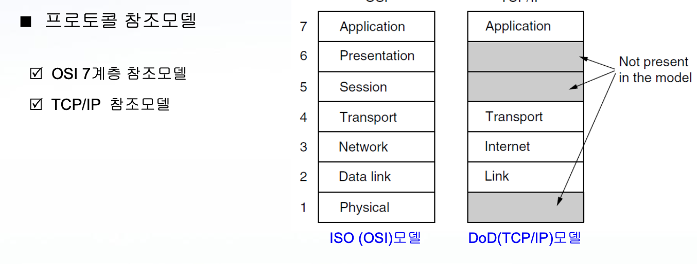
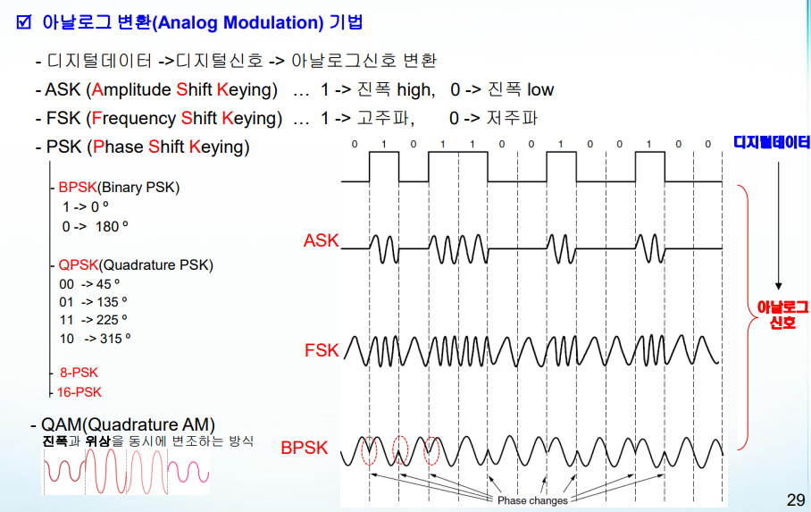
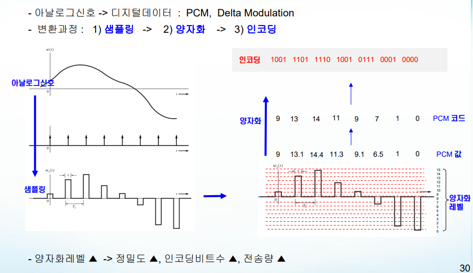
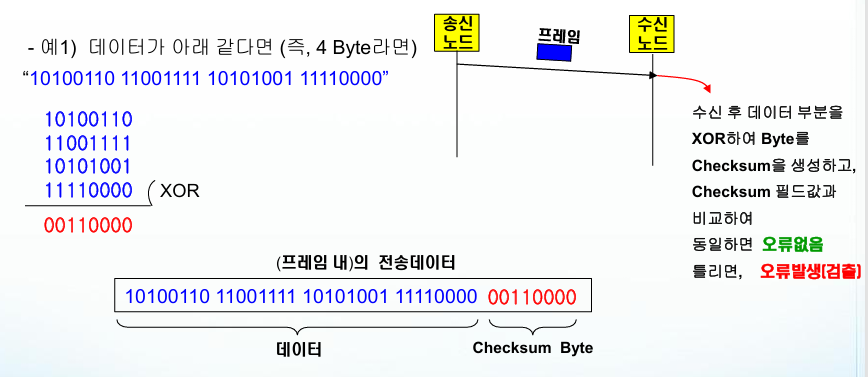
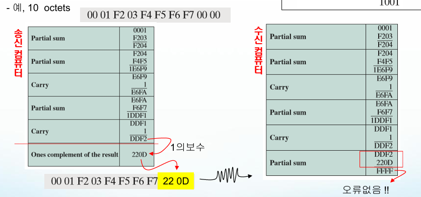
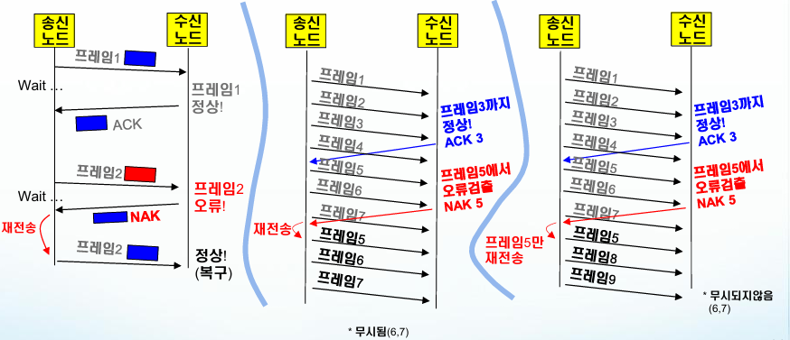
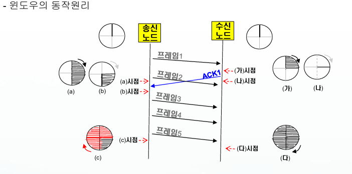
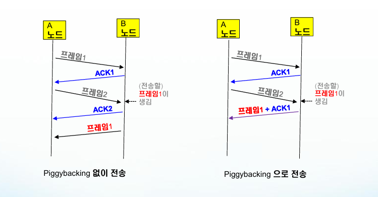
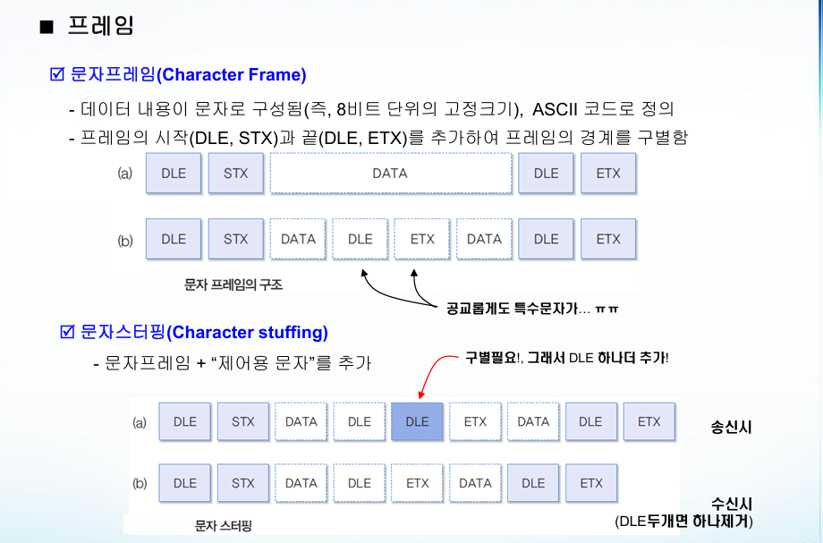

# 1차 쪽지시험

## Chapter. 2 물리계층

### 데이터 통신

#### 데이터 통신
 : 컴퓨터를 전선(전송매체)으로 연결하고, 이 매체로 데이터를 송신/수신하는 기술  
 : 통신할 컴퓨터가 점점 많아지면, 송수신 통신기술이 크게 복잡해지는 문제가 발생한다.

#### 프로토콜(Protocol)
 : 다양한 네트워크에서 정확한 통신을 이루려면 통신용 약속이 필요한데,   
 데이터를 송/수신간에 정확히 주고 받기 위해, 정해진 전송규약

#### 프로토콜의 특징
```
 1) 계층화
 2) 유지보수/변경이 용이
 3) 표준화
```

#### 프로토콜의 3대요소
 1) **Syntax(형식)** : 송수신기간의 주고받아야 할 **전송데이터의 포맷** 정의
 2) **semantic(의미)** : 송수신기간의 상호협력을 위한 **제어정보**를 정의
 3) **Timing(타이밍)** : 송수신기간의 전송데이터를 주고 받을 때 **속도와 전송절차**를 정의

#### 프로토콜 설계
1) **주소설정** : 네트워크 상에서 송/수신 호스트를 구분하기 위한 식별자
2) **오류제어** : 신호감쇄/왜곡으로 인한 오류발생 > 탐지 > 복구
3) **흐름제어** : 수신호스트의 버퍼처리속도가 늦어서 송신호스트의 속도를 제어
4) **연결제어** : 데이터를 전송하기 전에 상호 송수신이 가능한 상태로 설정/해제/관리하는 제어
5) **순서제어** : 전송데이터에 순서를 매겨서 메세지의 분실여부, 재전송에 사용
6) **전송데이터의 단편화/재조합** : 전송효율을 높이고자 작은 크기의 전송메세지를 줄여 전송 후 수신할 때 응용 프로그램에서 원래의 크기로 재조합하는 과정
7) **캡슐화** : 데이터를 제어 정보를 덧붙임
8) **동기화** : 여러 시스템이 동시에 통신할 수 있는 기법

#### 전송모드
1) **단방향 모드** : 오직 한방향으로만 전송하는 모드
2) **반이중 모드** : 동시에 한방향으로만 전송
3) **전이중(양방향) 모드** : 동시에 양방향으로 전송

#### 프로토콜 참조모델(7계층)



#### 물리 계층
 : 데이터를 전송하기 위한 전송매체의 기계적 규적을 정의, 전기적신호의 전송규격을 정의

#### Twisted Pair(TP)
 : 두 개의 구리도선을 꼬아서 엮은 전송매체

#### STP(Shielded)
 : 간섭에 민감한 정부기관 혹은 금융기관, 병원에서 사용됨

#### UTP(UnShielded)
 : 일반 가정 환경에서 많이 사용되며 비용이 STP에 비해 훨씬 저렴함

#### Coaxial Cable
 : 장거리 전송용으로 성능이 좋은 전송매체(TV, CCTV 선 등)

#### Fiber Cable
 : 광섬유를 이용하여, 빛에 데이터를 실어서 전송하는 전송매체

#### 무선 전송매체의 전파 유형
 1) 지면전파 : 대기권의 낮은 부분으로 전자기파를 전파하는 방식  
 2) 공중전파 : 안테나를 전파하거나, 전리층에서 반사하는 방식으로 전파  
 3) 가시선전파 : 안테나간 높은 주파수로 전파

<div style="page-break-before: always;"></div>

#### 무선 전송매체
 1) RadioWave : 고체, 진공, 대기를 모두 통과하여 전파 ( 3KHz ~ 300MHz )
 2) MicroWave : 지향성, 단방향 전파, 가시선 전파, 벽을 통과 못함 ( 300MHz ~ 300GHz )
 3) Infrared(적외선) : 단거리 전파에 적합하며, 열에너지를 포함하고 있어 물체를 따듯하게 만듬 ( 300GHz ~ 400THz )

### 신호처리

#### 데이터 전송 
 : 이진데이터를 전기적 신호로 변환하고, 전파시킴 ( 송신할 데이터 > 신호 > 수신할 데이터 )
```
[신호 변환]
 - 아날로그 신호 <-> 아날로그 데이터
 - 아날로그 신호 <-> 디지털 신호
 - 디지털 신호 <-> 아날로그 데이터
 - 디지털 신호 <-> 디지털 데이터

[전송]
 - 아날로그 전송
 - 디지털 전송
```

#### 신호
 1) 진폭 : 신호의 높이  
 2) 주기 : 반복되는 패턴(단위 초) | 주기 = 1 / 주파수Hz  
 3) 주파수 : 1초당 주기의 반복횟수(단위 Hz)   


<div style="page-break-before: always;"></div>

 #### 디지털 변환 기법

 
 #### 아날로그 변환 기법
 

<div style="page-break-before: always;"></div>

 #### PCM(Pulse Code Modulation) 기법
 : 아날로그신호 -> 디지털 데이터
  > 변환과정 : 1) 샘플링 -> 2) 양자화 -> 3) 인코딩  

  **양자화 레벨이 높을수록 정밀도와 전송량이 증가한다**

  

  #### 전송장애(전송오류)
  1) 신호감쇄
  2) 왜곡
  3) 잡음
  4) 간섭

  #### 물리계층의 대표장비
  1) 증폭기
   : 감쇄된 신호크기를 증폭시켜 원래의 신호크기로 키워주는 장치 / 증폭기로 신호를 증폭한다

  2) 리피터
  : 수신한 신호를 다시 인코딩하여 송신하는 장치 / 리피터로 신호를 재생한다(케이블 연장 선)

<div style="page-break-before: always;"></div>

  ## Chapter 3. 데이터링크 계층
  
  #### 데이터 링크 계층
   : **노드와 노드 간의 오류가 없는 데이터전송**울 하기 위한 목표로 전송 규격을 정의 

  #### 데이터 링크 계층의 핵심기능
  1) 주소 관리 : 물리 주소 체계를 정의
  2) 접근제어/링크제어 : 물류계층의 특성과 구조에 맞게 접근
  3) 프레임생성/관리 : 데이터를 캡슐화한 프레임형식으로의 생성 및 관리
  4) 오류 제어 : 오류를 탐지하고 복구
  5) 흐름 제어 : 수신기가 송신기의 전송속도를 제어

#### 오류의 원인
1) 물리계층의 전송 장애로 오류 발생
2) 송신노드 또는 수신노드의 장애
3) 전송매체의 절단, 파괴 등의 장애
4) 저속 전송매체로 데이터를 빠른속도로 무리하게 송신하는 경우


#### 프레임
: 데이터 링크 계층에서 전송되는 전송 데이터 단위를 뜻함

#### 오류 검출
1) Parity비트 검출법  
 : 데이터에서 1의 개수를 홀수(또는 짝수)로 맞추어 전송하며, 수신계에서 개수를 확인하는 기법  
 : 문제점으로는 2비트 이상이 오류 나면 검출 성능이 떨어진다  
  (Even : 짝수, Odd : 홀수)  

2) 2차원 Parity비트 검출법
 : 데이터를 (블록단위) 분할 후, 행과 열에 각각 비트를 추가하여 오류를 검출
 

3) CheckSum (1Byte) 검출법
 : 데이터를 1 Byte단위로 XOR를 하여 CheckSum을 생성한 후 전송
 

4) Internet CheckSum 검출법 (2Byte)


16진수 1의 보수는 15-N (1~9 A~F)

### 오류 복구/정정

#### 역방향 오류 정정
1) **Stop-And-Wait ARQ**  
 : 프레임 1개를 전송할 때마다 , ACK를 기다림

2) **Go-Back-N ARQ**  
 : 프레임을 계속 보내다가, NAK가 온 이후의 모든 프레임을 재전송함

3) **Selective-reject ARQ**   
 : 프레임을 계속 보내다가, NAK가 온 프레임만 재전송
 

<div style="page-break-before: always;"></div>

#### 전방향 오류 정정
 : 수신된 프레임만을 가지고 오류정정을 할 수 있는 방식  
 

 모든 패리티가 0이면 오류가 없는 것이고, 그렇지 않으면 오류가 발생한 것이다.  
 결과가 0101이면 오류가 있는 숫자이고, 이를 10진수로 변환하면 5 ( 0 + 4 + 0 + 1 )   

 #### 흐름 제어
  : 흐름 제어 원인 : 송신노드와 수신노드의 처리성능이 다르기에 필요한 제어 기능  
  : 흐름 제어 방법 : 수신노드가 송신노드의 송신 시점을 제어함

 1) Stop & Wait 흐름 제어 기법
  : 전송 프레임당 응답을 수신하는 흐름제어 기법  
  

 2) Sliding Windows 흐름제어 기법
  : 응답없이 보낼 수 있는 프레임의 최대 개수를 채택함(범위 : 0 ~ 2ⁿ - 1)  
  

 3) PiggyBacking 기법
  : 응답용 ACK 프레임을 별도로 전송하지 않고, 데이터 프레임에 응답을 같이 포함시켜 보내는 기법
 

### 문자프레임


#### 접근제어/링크제어관리

 1) Point-to-Point (1대1 구성)
  : 매체접근 시 노드끼리 경쟁할 필요가 없어, 단순한 송수신 절차만 관리

 2) Multi Drop (1대 N 구성)
  : 매체를 여러 노드가 공유하므로 노드 끼리 충돌 될 수 있어 서로 경쟁함 (접근제어와 주소가 필요)


<div style="page-break-before: always;"></div>

## Chapter 4. 데이터링크 계층 2

### 정규 응답모드 (Normal Response Mode)
 - 주국이 세션을 열고, 종국은 단지 응답만 하는 방식

### 비동기 균형모드 (Async Balanced Mode)
 - 균형적 링크로 서로 각자 명령과 응답을 하여 동작함 (전이중 전송방식에서 가장 효과적)

### 비동기 응답모드 (Async Response Mode)
 - 주국만이 전체적인 전송개시를 담당